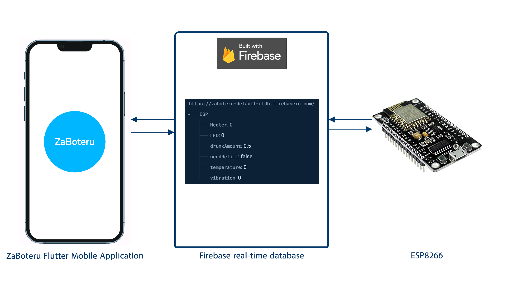
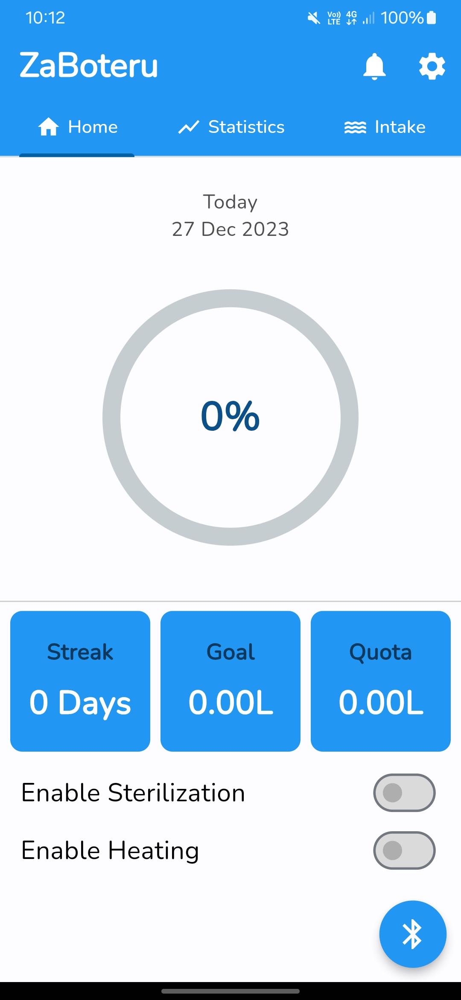
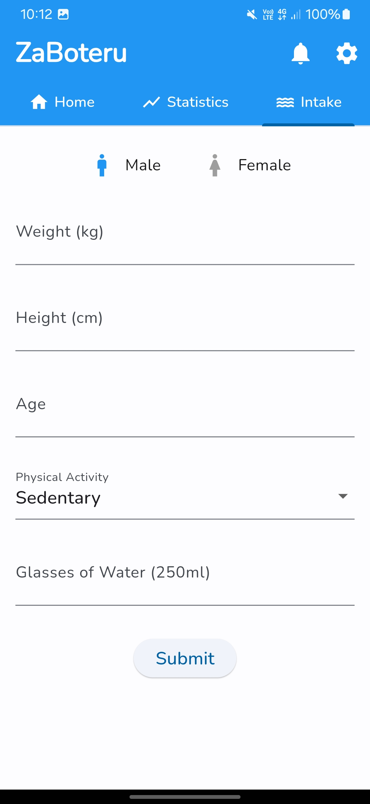

# ZaBoteru

## Table of Contents
- [Description](#description)
- [Features](#features)
- [Quick Preview](#quick-preview)
- [Install it NOW!](#install-it-now)
- [Toolstack](#toolstack)
- [Future Updates](#future-updates)
- [Help](#help)
- [Contribution](#contribution)
- [License](#license)

## Description

ZaBoteru is a user-friendly mobile app designed to combat dehydration. Paired with our innovative ZaBoteru Smart Bottle, it allows users to monitor their water intake and receive reminders to stay hydrated. Discover more features [here](#features).

## Features

:white_check_mark: **Water Intake Calculator**

:white_check_mark: **Water Intake Tracking**

:white_check_mark: **Goal Reminders**

:white_check_mark: **Control Water Temperature**

:white_check_mark: **Control Water Sterilization**

## Quick Preview

### Our System Architecture

### User Interface

| Dashboard | Intake Calculator |
| :-: | :-: |
|  |  |

## Install it NOW!

Simply download the APK from [here](Built-Version) and install it on your device like any other app.

## Toolstack

## Future Updates

- Provide the user with statistics on his/her water intake.
- Enable the user to add other drinks.
- Add a dark mode.

## Help

If you encounter any issues or have questions, feel free to reach out.

## Contribution

|  |  |  |  |  |
| :-: | :-: | :-: | :-: | :-: |
| [Kareem Noureddine](https://github.com/cln-Kafka) | [Salma Ashraf](https://github.com/Salma-me) | [Salma Abd El-Tawab](https://github.com/SalmaAbeltawab) | [Sara Ibrahim](https://github.com/sarah1ibrahim) | [Assem Hussein](https://github.com/RushingBlast) |

## License

All rights reserved © 2023 to Team 02 of the Assistive Technologies Course - Systems & Biomedical Engineering, Cairo University (Class 2025).
